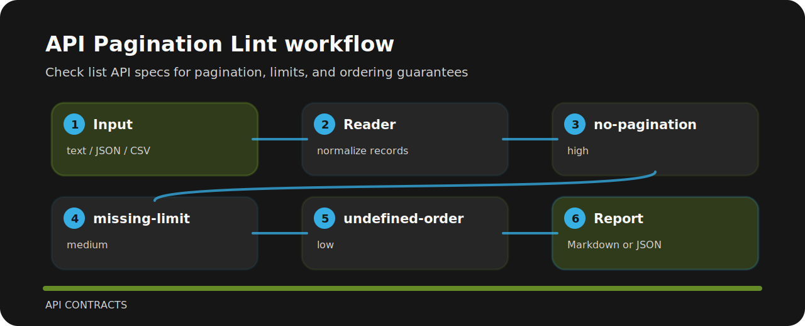

# API Pagination Lint

| Field | Value |
| --- | --- |
| Area | api contracts |
| Command | `api-pagination-lint` |
| Example | `examples/sample.txt` |


This repository turns a tiny plain text into reviewable signals for API operations.

## Decision points

- `no-pagination` - list endpoint lacks pagination (high); Add cursor or page-based pagination..
- `missing-limit` - limit is missing (medium); Declare default and maximum page sizes..
- `undefined-order` - result ordering is undefined (low); Document stable sort order..

## Review path



## Try the fixture

```bash
git clone https://github.com/mertefekurt/api-pagination-lint.git
cd api-pagination-lint
python -m pip install -e ".[dev]"
api-pagination-lint examples/sample.txt
```
