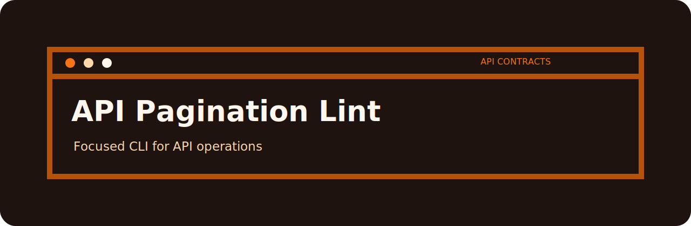

# API Pagination Lint

> Check list API specs for pagination, limits, and ordering guarantees

This is a review desk for API operations. The useful part is not a dashboard; it is the tiny repeatable moment where vague records become specific findings.

## Finding catalog for `api-pagination-lint`

| Finding | Level | Why it matters |
| --- | --- | --- |
| `no-pagination` | high | list endpoint lacks pagination |
| `missing-limit` | medium | limit is missing |
| `undefined-order` | low | result ordering is undefined |

## Try the sample

```bash
git clone https://github.com/mertefekurt/api-pagination-lint.git
cd api-pagination-lint
python -m venv .venv
source .venv/bin/activate
python -m pip install -e ".[dev]"
```

```bash
api-pagination-lint examples/sample.txt
api-pagination-lint examples/sample.txt --json
```

## Reading the output

- Markdown is meant for humans reviewing a change.
- JSON is meant for CI, scripts, or saved reports.
- `--fail-on` lets the repo decide how strict a gate should be.
